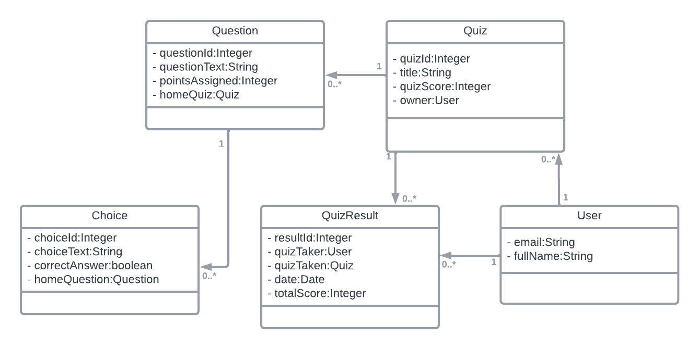

# Quiz Maker Application

## Description

The project is an application backend developed to enable users to create, administer, and participate in quizzes. 

## Frontend
You can view the frontend repo [here](https://github.com/SamahZughaibi/java-angular-project-sda)


## Class Diagram



## Setup

**Installation**:

1. Clone the repository to your local machine:
```bash
git clone https://github.com/SamahZughaibi/java-project1-github-repo-sda.git
```

2. Navigate to the project directory:

```bash
cd java-project1-github-repo-sda
```
3. Install IntelliJ IDE, and open the project directory.

4. Establish a database connection.

5. Run the program.


## Technologies Used

- Spring Framework
- Spring Boot
- Spring Data JPA
- JUnit
- MockMVC
- Lombok Library

## Controllers and Routes Structure

- #### User Controller
| HTTP Method | Endpoint                     | Description                                       |
|-------------|------------------------------|---------------------------------------------------|
| GET         | `/api/users`                 | Retrieve all users.                              |
| GET         | `/api/user/{email}`          | Retrieve a user by their email.                   |
| GET         | `/api/user/{email}/quizzes`  | Retrieve all quizzes associated with a user.      |
| GET         | `/api/user/{email}/results`  | Retrieve quiz results for a user.                 |
| GET         | `/api/user/{email}/resultsOfQuiz` | Retrieve quiz results for a quiz owned by a user. |
| GET         | `/api/user/{email}/questions`| Retrieve all questions associated with a user.    |
| GET         | `/api/user/{email}/choices`  | Retrieve all choices associated with a user.      |
| POST        | `/api/users`                 | Create a new user.                                |
| POST        | `/api/users/quizzes`         | Add a quiz for a user.                            |
| PATCH       | `/api/user/fullName/{email}` | Update user's full name.                          |

- #### Quiz Controller
| HTTP Method | Endpoint                                 | Description                                       |
|-------------|------------------------------------------|---------------------------------------------------|
| GET         | `/api/quizzes`                           | Retrieve all quizzes.                             |
| GET         | `/api/quizzes/{quizId}/questions`        | Retrieve all questions for a specific quiz.       |
| POST        | `/api/quizzes/questions`                 | Add a question to a quiz.                         |
| PATCH       | `/api/quizzes/title/{quizId}`            | Update the title of a quiz.                       |
| DELETE      | `/api/quizzes/{quizId}`                  | Delete a quiz by its ID.                          |

- #### Question Controller
| HTTP Method | Endpoint                                | Description                                  |
|-------------|-----------------------------------------|----------------------------------------------|
| GET         | `/api/questions`                         | Retrieve all questions.                      |
| GET         | `/api/questions/{questionId}/choices`    | Retrieve all choices for a specific question. |
| POST        | `/api/questions/choices`                 | Add a choice to a question.                  |
| PATCH       | `/api/questions/text/{questionId}`        | Update the text of a question.               |
| DELETE      | `/api/questions/{questionId}`            | Delete a question by its ID.                 |

- #### Choice Controller
| HTTP Method | Endpoint                    | Description                              |
|-------------|-----------------------------|------------------------------------------|
| GET         | `/api/choices`              | Retrieve all choices.                    |
| DELETE      | `/api/choices/{choiceId}`   | Delete a choice by its ID.               |


- #### QuizResult Controller 
| HTTP Method | Endpoint                           | Description                                  |
|-------------|------------------------------------|----------------------------------------------|
| GET         | `/api/results`                     | Retrieve all quiz results.                   |
| POST        | `/api/results`                     | Add a quiz result.                           |
| DELETE      | `/api/results/{resultId}`          | Delete a quiz result by its ID.              |


## Extra Links

- [Presentation Slides](https://docs.google.com/presentation/d/1stFo-EYJtBmB_UE0bkDOlAQj8Bh0rc7QH58UuyTZwB8/edit?usp=sharing)


## Future Work

- User login
- Verifying if the owner is the user that is making changes to a quiz, question, or choice.
- Enabling user to customize grades
- Providing a shareable quiz link.

## Resources

- MavenRepository

## Team Members

Samah Alzughaibi
